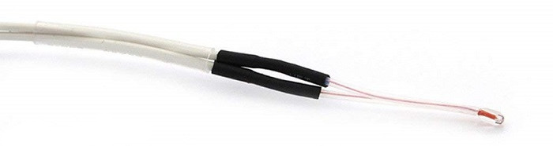

# Z Thermal Adjust

This guide outlines how to setup frame thermal expansion compensation using the `z_thermal_adjust` module.

## Contents

1. [Frame Temperature Sensor](#frame-temperature-sensor)
   - [Thermistor Selection](#thermistor-selection)
   - [Mounting Options](#mounting-options)
0. [Klipper Setup](#klipper-configuration)
   - [Klipper Configuration](#klipper-configuration)
0. [Temperature Coefficient Measurement](#temperature-coefficient-measurement)
0. [Background: What/Why](#background-whatwhy)

## 1. Frame Temperature Sensor
A temperature sensor must be coupled to the frame of the printer for both operation and calibration. 

### Thermistor Selection
A glass-bead/resin-coated style thermistor, such as the common NTC 3950 100k below, is a good option for its small form factor; its small size and low thermal mass make it easy to effectively couple to the frame.



### Mounting Options
In testing, the inside of a vertical frame member made for the best mounting location. They're subject to less conductive heat from the bed and insulated from errant gusts of hot air in the chamber. They are typically coupled one of two ways:
-   In the central bore of an aluminum extrusion
    -   Air contact is sufficient here, as temperature change is generally slow and the sensor quick to respond
    -   Location within the extrusion was not found to be critical
        -   Approximately halfway is a safe bet
-   Fixed to one of the interior slots of the aluminum extrusion
    -   In direct physical contact with the frame
    -   Insulated from the air and radiant heat by e.g. kapton tape and insulating cloth

## 2. Klipper Setup

### Klipper Configuration
Make the following changes to your `printer.cfg` configuration file.

#### *1. (Optional) Improve Thermistor Linearity*
Define the thermistor you're using with three temperature points encompassing the expected temperature range of your frame, e.g. 25-50c. This improves the linearity of the temperature measurements and later, calibration.

For example, the NTC 3950 100k, this would look like this:
```ini
[thermistor low_temp_3950]
temperature1: 20
resistance1: 125245
temperature2: 50
resistance2: 35900
temperature3: 80
resistance3: 12933
```
**NOTE** this must be placed *before* the following sensor definition in your config file.

#### *2. Configure the Z Thermal Adjust module*
Add the Z Thermal Adjust configuration section:

```ini
[z_thermal_adjust]
#temp_coeff:
#   The temperature coefficient of expansion, in mm/degC. For example, a
#   temp_coeff of 0.01 mm/degC will move the Z axis downwards by 0.01 mm for
#   every degree Celsius that the temperature sensor increases. Defaults to
#   0.0 mm/degC, which applies no adjustment.
#smooth_time:
#   Smoothing window applied to the temperature sensor, in seconds. Can reduce
#   motor noise from excessive small corrections in response to sensor noise.
#   The default is 2.0 seconds.
#z_adjust_off_above:
#   Disables adjustments above this Z height [mm]. The last computed correction
#   will remain applied until the toolhead moves below the specified Z height
#   again. The default is 99999999.0 mm (always on).
#max_z_adjustment:
#   Maximum absolute adjustment that can be applied to the Z axis [mm]. The
#   default is 99999999.0 mm (unlimited).
#sensor_type:
#sensor_pin:
#min_temp:
#max_temp:
#   Temperature sensor configuration.
#   See the "extruder" section for the definition of the above
#   parameters.
#gcode_id:
#   See the "heater_generic" section for the definition of this
#   parameter.
```

For now, leave `temp_coeff` at its default 0.0 mm/degC value, this will be calibrated in the next section. 

## Temperature Coefficient Measurement
TO DO

## Background: What/Why
TO DO